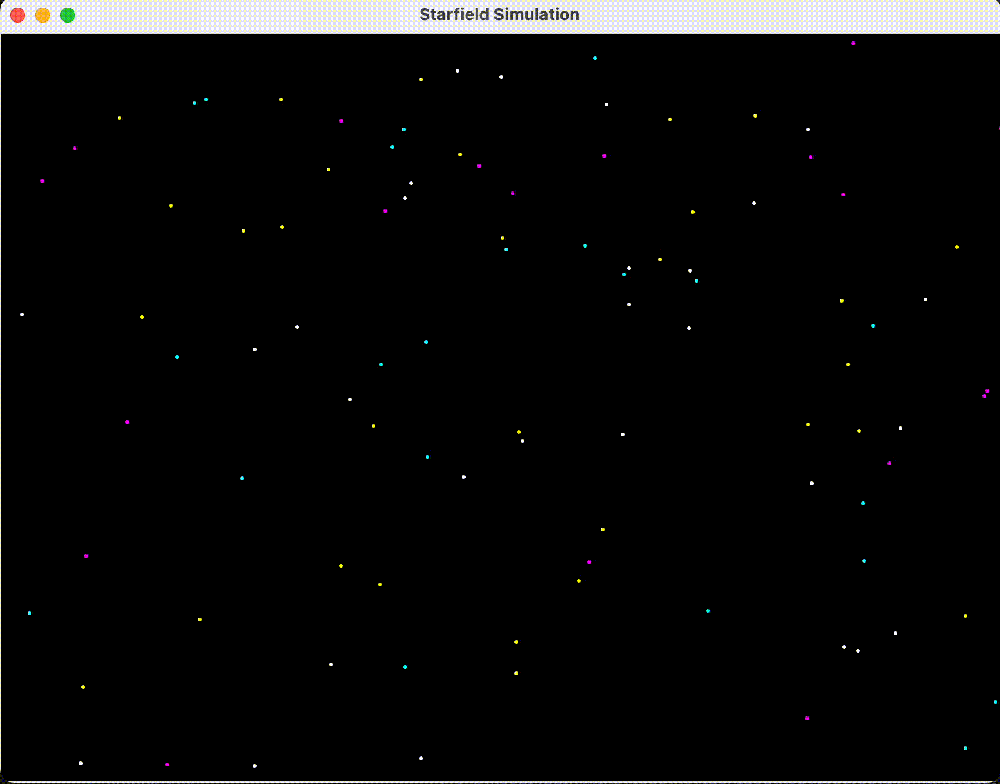

# Projects

Code In Place students take participate in a non-graded project after finishing their project. On Week 5, I showed how to use `graphics` module to create something and share with others, it's called `week5/simple_flags.py`. Viewable online here: [Simple Flags](https://codeinplace.stanford.edu/cip4/share/FgkTEfWM5ugsKxUVUsTk). I have created two additional projects to inspire students in my section. They need to be run locally as they require some elements only present in `graphics` module which are unpresent in CIP coding platform's `graphics` module. 

## Prerequisite

- Make sure your [Python is installed](https://realpython.com/installing-python/) on your system.
- Make sure Python's Tkinter library is installed.
    - macOS: `brew install python-tk`
    - Windows: `pip install tk`

## Starfield Simulation
- Clone this repo `git clone https://github.com/mkrdip/codeinplace-2024.git`
- `cd projects`
- Run `python3 starfield_simulation.py`
- Demo:

## City at Night
- Run `python3 city_night.py`
- Demo:

